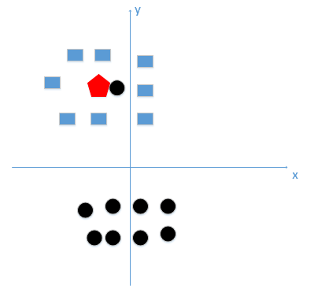
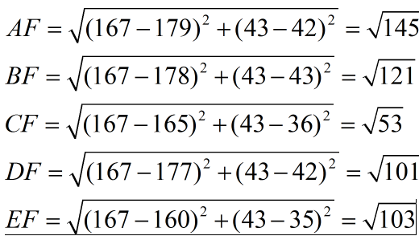

# 本文是关于KNN（K-邻近）算法的讲解

## 算法基本概念，原理

KNN算法，即给定一个训练集，对新的输入实例，在训练集上找到与该实例最临近的 K 个实例，这 K 个实例的多数属于某个类，就把该输入实例分类到这个类中。

这个算法还是很好理解的，有点类似与少数服从多数。
## 该方法中 K 的选取以及特征归一化的重要性

### K值的选择
如果我们选取较小的K值，那么很容易产生过拟合的问题。（如下图所示）

加入我们选取K=1这种情况，我们判定红色的类别就是黑类，但是其实应该属于蓝色的类，因为这个黑类其实是噪声，忽略了数据的真实分布，造成过拟合的情况。

如果我们选取较大的K值，就相当于用较大的邻域中的数据进行预测，这时候离输入实例较远的训练实例也会对预测起作用，会造成错误。

可以明显感觉到K取过大是有问题的了吧！这个时候，模型过于简单，完全忽略训练数据中的大量有用的信息。

### 距离的度量
该算法是在训练数据集上找到与该实例最临近的K个实例，那么这个最邻近是如何度量的呢。
其中当p=2的时候（二维），就是我们最常见的欧式距离，我们也一般都用欧式距离来衡量我们高维空间中俩点的距离。在实际应用中，距离函数的选择应该根据数据的特性和分析的需要而定，一般选取p=2欧式距离表示，这不是本文的重点。

### 特征归一化
首先举例如下，我用一个人身高(cm)与脚码（尺码）大小来作为特征值，类别为男性或者女性。我们现在如果有5个训练样本，分布如下：

A [(179,42),男] 
B [(178,43),男] 
C [(165,36)女] 
D [(177,42),男] 
E [(160,35),女]

观察训练样本，会发现一个问题，就是身高的值过大，在计算距离时所占的权重更大，这样整个判断依据会偏向于身高这个第一维的特征。
现在我来了一个测试样本 F(167,43)，让我们来预测他是男性还是女性，我们采取k=3来预测。下面我们用欧式距离分别算出F离训练样本的欧式距离，然后选取最近的3个，多数类别就是我们最终的结果，计算如下：

由计算可以得到，最近的前三个分别是C,D,E三个样本，那么由C,E为女性，D为男性，女性多于男性得到我们要预测的结果为女性。
这样问题就来了，一个女性的脚43码的可能性，远远小于男性脚43码的可能性，那么为什么算法还是会预测F为女性呢？那是因为由于各个特征量纲的不同，在这里导致了身高的重要性已经远远大于脚码了，这是不客观的。

这个时候就需要对数据进行归一化，其目的是让每个特征都是同等重要的。
归一化有两种方法：
1：最值归一化：把所有数据映射到0-1之间
Xscale = （X-Xmin）/（Xmax - Xmin）
2：均值方差归一化：把所有数据归一到均值为0方差为1的分布中。
Xscale = （X - Xmean）/S