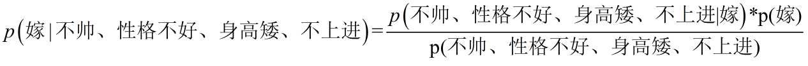
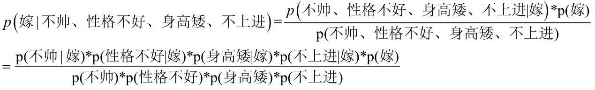

## 朴素贝叶斯算法

首先是贝叶斯的公式： P(B|A) = P(B)P(A|B)/P(A)

将该公式进行转换 P（类别|特征） = P(特征|类别)×P（类别）/P(特征)

现在给我们的问题是，如果一对男女朋友，男生想女生求婚，男生的四个特点分别是不帅，性格不好，身高矮，不上进，请你判断一下女生是嫁还是不嫁？
这是一个典型的分类问题，转为数学问题就是比较p(嫁|(不帅、性格不好、身高矮、不上进))与p(不嫁|(不帅、性格不好、身高矮、不上进))的概率，谁的概率大，我就能给出嫁或者不嫁的答案！

这里联系到朴素贝叶斯公式：

我们需要求p(嫁|(不帅、性格不好、身高矮、不上进),这是我们不知道的，但是通过朴素贝叶斯公式可以转化为好求的三个量，p(不帅、性格不好、身高矮、不上进|嫁)、p（不帅、性格不好、身高矮、不上进)、p(嫁)。

p(不帅、性格不好、身高矮、不上进|嫁) = p(不帅|嫁)*p(性格不好|嫁)*p(身高矮|嫁)*p(不上进|嫁)，那么我就要分别统计后面几个概率，也就得到了左边的概率。
（朴素贝叶斯算法是假设各个特征之间相互独立，那么这个等式就成立）

朴素贝叶斯的公式可以进一步优化如下所示

这样根据样本的概率就可以求解了。
就是这么朴实无华的简单