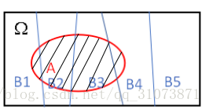
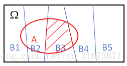

# 贝叶斯公式的理解和简单推导

首先回顾一些基础概念
## 概率(Probability)
举例：假如我告诉你腾讯股票明天上涨的可能性很大，同时我也告诉你阿里巴巴股票明天上涨的可能性很大。然而不幸的是，我只告诉了你两个股票都可能上涨，但是依然无法判断出哪只股票更好。
但是如果我告诉你腾讯股票上涨的可能性是70%，阿里巴巴上涨的可能性是90%，这个时候你就知道如何选择了。

概率就是用数值来表示某件事发生的可能性。可以通过概率来判断哪种可能性最大。

## 什么是相关事件
“相关”的意思是 受过去事件的影响
这里举一个相关事件的经典案例：
####
    事件A：小米手机的销量
    事件B：电商只占商品零售总额的10%
这里的事件A和B，就是相关事件

## 什么是条件概率
相关事件的概率也叫条件概率！
根据上述的列子，就是说事件A在事件B已经发生条件下的发生概率
这里再举例（红球篮球实验）
####
    布袋里有两颗蓝色球和三颗红色球，每次随机从布袋里拿一颗，拿完不放回。连续2次拿到篮球的概率是多少
####
在计算概率之前，我们需要弄清楚，第一次拿球和第二次拿球是相关事件还是独立事。

在解决这类问题时，往往通过决策数进行辅助计算：
1：拿第一颗球时，有2/5的概率拿篮球，3/5的概率拿红球。
2：拿第二颗球时，若先拿的是蓝色，第二颗再拿蓝色的概率是1/4，第二颗是红色的概率是3/4.

## 条件概率的数学表示
P（AB） = P(A) * P(B|A)
事件A与实践B的概率等于事件A的概率×实践A发生的条件下，事件B发生的概率。

## 全概率公式
设A，B两个事件，在B发生的条件下，事件A发生的概率为：（根据上式子做简单变形）
P(A|B) = P(AB)/P(B)

1:乘法公式：
由条件概率公式可以得到： P(AB) = P(B)*P(A|B) = P(A)*P(B|A)
该式子即为乘法公式

2：乘法公式的推广： 
P(A1A2...An-1An)=P(A1)P(A2|A1)P(A3|A1A2)...P(An|A1A2...An-1) 
上述式子是非常直觉的

3：全概率公式：
当直接计算P(A)较为困难,而P(Bi),P(A|Bi)  (i=1,2,...)的计算较为简单时，可以利用全概率公式计算P(A)。思想就是，将事件A分解成几个小事件，通过求小事件的概率，然后相加从而求得事件A的概率，而将事件A进行分割的时候，不是直接对A进行分割，而是先找到样本空间Ω的一个个划分B1,B2,...Bn,这样事件A就被事件AB1,AB2,...ABn分解成了n部分，即A=AB1+AB2+...+ABn, 每一Bi发生都可能导致A发生相应的概率是P(A|Bi)，由加法公式得
P(A) = P(AB1)+P(AB2)+....+P(ABn) = P(A|B1)P(B1)+P(A|B2)P(B2)+...+P(A|Bn)P(PBn)

## 贝叶斯公式
P(A∣B) =  P(B∣A)∗P(A)/P(B)
单论公式来看，其实就是对乘法公式换了一种表达方式而已。

如上图所示的话，即求的是在A发生的条件下，B3发生的概率，P(B3)为先验概率，而最终求得的P(B3|3)为后验概率。