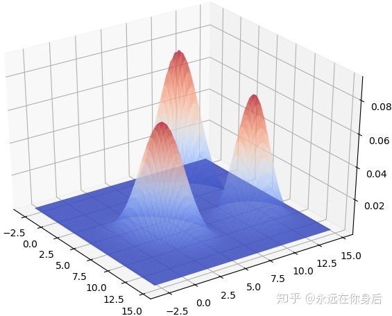
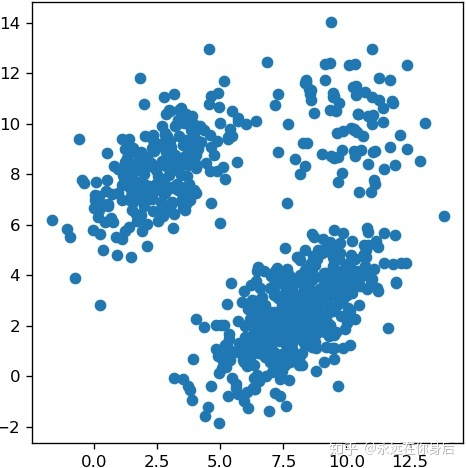
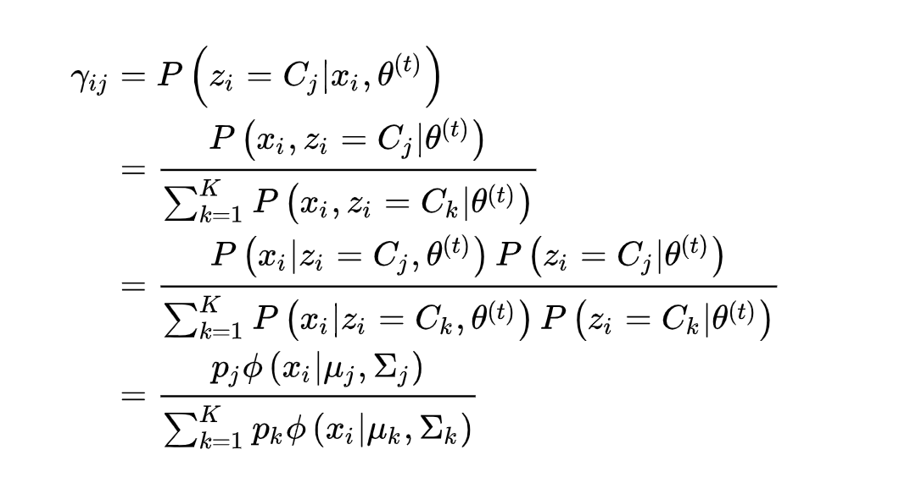
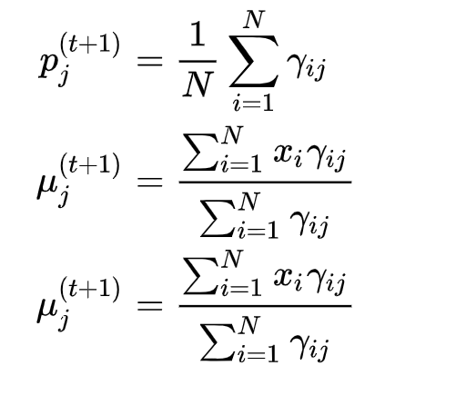

# 高斯混合模型（GMM）原理推导

## 高斯分布的概念
高斯混合模型聚类也是一种聚类方法。

GMM是一个生成模型，它假设数据是从多个高斯分布中生成的。
一种理解就是，假设有K个高斯分布，每一个分布有一个权重，每当生成一个数据的时候，就按权重的比例随机选择一个分布，然后按这个分布生成数据。
而另一种理解就是高斯混合其实就是多个高斯分布的加权平均。

如果按照第二种理解即要设计一个参数，该参数为每一个高斯分布的权重值，而按第一种理解，该权重其实是某一个类别的随机变量。该变量为latent variable。
因为是随机变量所以存在概率分布，该概率分布如下所示：

| Z| C1 | C2 | ...| Ck |
| ------ | ------ | ------ | ------ | ------ |
| P(Z) | P1 | P2 |... | Pk |
其中Ci表示样本属于某个类别，P（z）为其概率分布，或者理解为权重值。

根据上述加权平均的规则，GMM生成的样本X的概率密度函数如下所示：
$ P(x|\theta) = \sum_{i}^k p_{i}*N(x|\mu_{i},\Sigma_{i}) $

下图展示了三个高斯分布混合后的三维图像。

下图展示的是该高斯混合分布的平面图，即直观展示两个特征的对样本的影响。

而GMM的目的就是根据这个二维的平面图，即各维度特征值已知的情况下，对 $(P(z),\mu,\Sigma) $这三个参数进行初始化，然后不断更新迭代更新参数，使得最终该样本的高斯混合模型分布越来越与三维图中的靠拢。

## 高斯分布的数学推倒（EM算法）
高斯混合模型在训练时采用了极大似然估计法，即最大化对数似然函数：
$ L = log\prod_{j=1}^m p(x) = \sum_{j=1}^mlog\sum_{i=1}^k p_{i}*N(x|\mu_{i},\Sigma_{i}) $
因为上式无法直接通过解析方式求解，所以采用EM算法进行迭代优化求解。
### EM中的E
下图所示后验概率表示的是在第Xj个样本发生的情况下，该样本是由第i个高斯分布造成的概率。

### EM中的M

### 代码实现
####
    import numpy as np
    from scipy import stats

    class GMM(object):
    def __init__(self, k: int, d: int):
        '''
        k: K值
        d: 样本属性的数量
        '''
        self.K = k
        # 初始化参数
        self.p = np.random.rand(k)
        self.p = self.p / self.p.sum()      # 保证所有p_k的和为1
        self.means = np.random.rand(k, d)
        self.covs = np.empty((k, d, d))
        for i in range(k):                  # 随机生成协方差矩阵，必须是半正定矩阵
            self.covs[i] = np.eye(d) * np.random.rand(1) * k

    def fit(self, data: np.ndarray):
        '''
        data: 数据矩阵，每一行是一个样本，shape = (N, d)
        '''
        for _ in range(100):
            density = np.empty((len(data), self.K))
            for i in range(self.K):
                # 生成K个概率密度函数并计算对于所有样本的概率密度
                norm = stats.multivariate_normal(self.means[i], self.covs[i])
                density[:,i] = norm.pdf(data)
            # 计算所有样本属于每一类别的后验
            posterior = density * self.p
            posterior = posterior / posterior.sum(axis=1, keepdims=True)
            # 计算下一时刻的参数值
            p_hat = posterior.sum(axis=0)
            mean_hat = np.tensordot(posterior, data, axes=[0, 0])
            # 计算协方差
            cov_hat = np.empty(self.covs.shape)
            for i in range(self.K):
                tmp = data - self.means[i]
                cov_hat[i] = np.dot(tmp.T*posterior[:,i], tmp) / p_hat[i]
            # 更新参数
            self.covs = cov_hat
            self.means = mean_hat / p_hat.reshape(-1,1)
            self.p = p_hat / len(data)

        print(self.p)
        print(self.means)
        print(self.covs)     